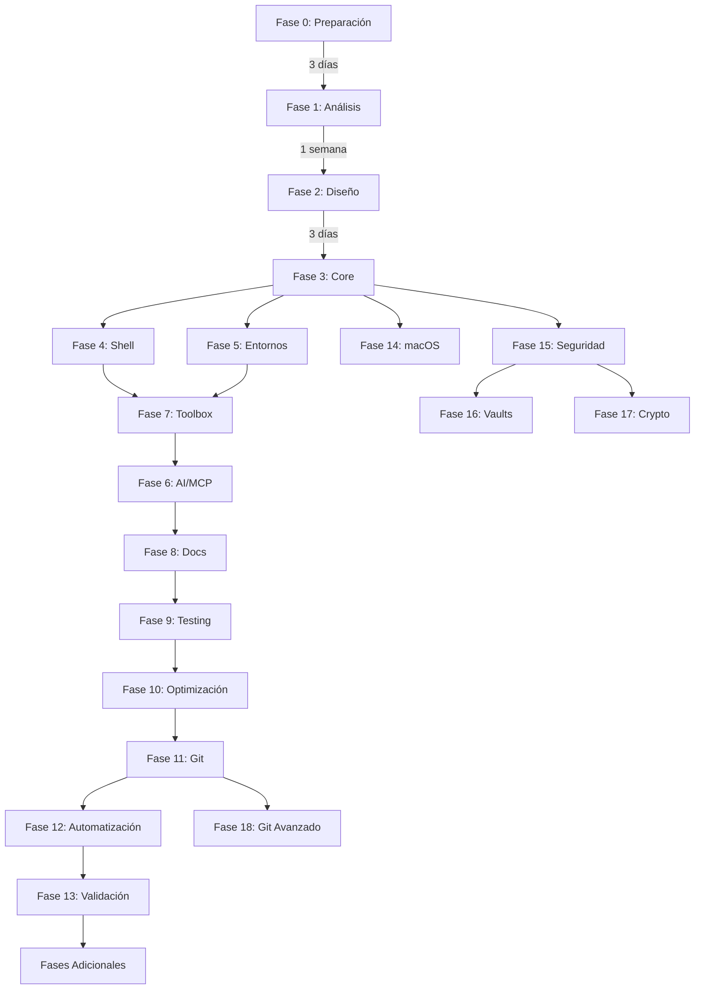

# Roadmap - Migración .dotfiles con SuperClaude

## 🎯 Objetivo General

Transformar el repositorio `.dotfiles` en un sistema modular, testeable y profesional siguiendo mejores prácticas de desarrollo, integrado con SuperClaude, MCP y agentes especializados.

## 📅 Timeline Estimado

**Duración total**: 10-12 semanas
**Horas estimadas**: 150-180 horas

## 🗺️ Mapa de Fases

## 📋 Detalle por Fases

### 🛠️ Fase 0: Preparación (NUEVA)
**Objetivo**: Establecer fundamentos técnicos del proyecto
**Duración**: 3 días
**Tareas**: 4
**Entregables**:
- Sistema de versionado
- Biblioteca de logging
- Detección de plataforma
- CI/CD configurado

### 🔍 Fase 1: Análisis y Diagnóstico
**Objetivo**: Comprender el estado actual y identificar mejoras
**Duración**: 1 semana
**Tareas**: 4
**Entregables**:
- Análisis de arquitectura actual
- Evaluación de calidad
- Reporte de seguridad
- Diagnóstico de organización

### 🏗️ Fase 2: Diseño y Planificación
**Objetivo**: Diseñar la nueva arquitectura modular
**Duración**: 3 días
**Tareas**: 3
**Entregables**:
- Diseño de arquitectura modular
- Workflow de implementación
- Estimación detallada

### ⚙️ Fase 3: Implementación de Core
**Objetivo**: Establecer la base del sistema
**Duración**: 3 días
**Tareas**: 3
**Entregables**:
- Estructura de directorios
- Sistema bootstrap
- Instalador modular

### 🐚 Fase 4: Migración de Shell
**Objetivo**: Modernizar configuración shell
**Duración**: 4 días
**Tareas**: 3
**Entregables**:
- Zsh modular
- Organización de archivos
- Sistema de auto-carga

### 🌐 Fase 5: Configuración de Entornos
**Objetivo**: Gestión de lenguajes y herramientas
**Duración**: 3 días
**Tareas**: 2
**Entregables**:
- ASDF mejorado
- Scripts por lenguaje

### 🤖 Fase 6: Integración AI/MCP
**Objetivo**: Integrar capacidades de IA
**Duración**: 2 días
**Tareas**: 2
**Entregables**:
- Configuración MCP
- Comandos SuperClaude

### 🛠️ Fase 7: Toolbox y Scripts
**Objetivo**: Centralizar utilidades
**Duración**: 2 días
**Tareas**: 2
**Entregables**:
- Scripts migrados
- Funciones reutilizables

### 📚 Fase 8: Documentación
**Objetivo**: Documentar el sistema
**Duración**: 3 días
**Tareas**: 3
**Entregables**:
- README principal
- Documentación arquitectura
- Guías de setup

### 🧪 Fase 9: Testing y Validación
**Objetivo**: Asegurar calidad y compatibilidad
**Duración**: 3 días
**Tareas**: 3
**Entregables**:
- Tests de instalación
- Validación multi-plataforma
- Suite completa de tests

### ⚡ Fase 10: Optimización y Limpieza
**Objetivo**: Mejorar performance
**Duración**: 2 días
**Tareas**: 3
**Entregables**:
- Shell optimizado
- Código limpio
- Configuraciones comprimidas

### 🔄 Fase 11: Deployment y Git
**Objetivo**: Preparar para producción
**Duración**: 1 día
**Tareas**: 3
**Entregables**:
- Versionado configurado
- Estructura de branches
- Documentación de cambios

### 🎯 Fase 12: Automatización SuperClaude
**Objetivo**: Crear comandos personalizados
**Duración**: 2 días
**Tareas**: 3
**Entregables**:
- Comando analyze-dotfiles
- Comando sync-dotfiles
- Índice de comandos

### ✅ Fase 13: Validación Final
**Objetivo**: Verificar calidad final
**Duración**: 2 días
**Tareas**: 3
**Entregables**:
- Análisis de calidad final
- Reporte de migración
- Plan de mantenimiento

### 🍎 Fase 14: Componentes macOS
**Objetivo**: Migrar componentes específicos de macOS
**Duración**: 1 semana
**Tareas**: 8
**Entregables**:
- QMK configurado
- Fuentes organizadas
- SketchyBar, Yabai, SKHD migrados
- Terminal configurado
- Workflows integrados

### 🔐 Fase 15: Seguridad y Criptografía
**Objetivo**: Implementar seguridad robusta
**Duración**: 4 días
**Tareas**: 4
**Entregables**:
- SSH con hardware keys
- GPG configurado
- Gestión de secretos

### 🗄️ Fase 16: Vaults y Enlaces
**Objetivo**: Sistema de vaults unificado
**Duración**: 3 días
**Tareas**: 4
**Entregables**:
- Sistema de symlinks
- Integración cloud
- Obsidian/Notion configurados

### ₿ Fase 17: Criptomonedas y Web3
**Objetivo**: Configurar herramientas crypto
**Duración**: 3 días
**Tareas**: 4
**Entregables**:
- Ethereum configurado
- Bitcoin configurado
- Trezor integrado
- Scripts de seguridad

### 🔀 Fase 18: Git Avanzado
**Objetivo**: Git con capacidades avanzadas
**Duración**: 2 días
**Tareas**: 3
**Entregables**:
- Git con GPG
- Hooks personalizados
- Templates configurados

### 📦 Fases Adicionales
**Objetivo**: Completar testing y documentación
**Duración**: 4 días
**Tareas**: 4
**Entregables**:
- Tests unitarios completos
- Documentación de módulos
- Releases automáticos
- Validación final

## 🎯 Criterios de Éxito

1. **Modularidad**: Cada componente es independiente e instalable por separado
2. **Documentación**: 100% documentado y con guías claras
3. **Testing**: Cobertura >80% en componentes críticos
4. **Performance**: Tiempo de carga shell <200ms
5. **Seguridad**: Hardware keys integradas, secretos protegidos
6. **Portabilidad**: Funciona en macOS y Linux
7. **Inteligencia**: Integración completa con SuperClaude
8. **Profesionalismo**: CI/CD, versionado semántico, releases automatizados

## 🚀 Próximos Pasos

1. Comenzar con Fase 0: Preparación
2. Configurar `dottrack` para gestión del proceso
3. Documentar cada decisión y output
4. Revisar y ajustar plan según hallazgos

## 📊 Métricas de Progreso

- **Tareas completadas**: 0/68
- **Fases completadas**: 0/19
- **Tiempo invertido**: 0 horas
- **Bloqueadores actuales**: Ninguno

---

*Última actualización: [Fecha actual]*
